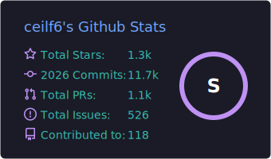
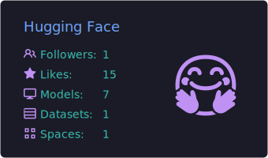
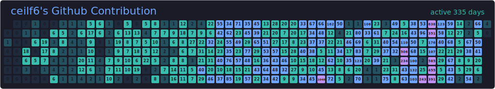

<h1 align="center">
  <code>Hi👋,我是&nbsp;ceilf6&nbsp;!</code>
</h1>

  &emsp;

  &emsp;

  <!--  -->
  如果想了解更多，点击上面👆对应卡片跳转

  05年生人，上海大学27届，联系 => 3506456886@qq.com

<h2 align="center">
  <code>我的一些荣誉</code>
</h2>

  
  <strong>&#x2060;<a href="https://ceilf6.github.io/ceilf6/viewer.html?img=0" target="_blank">字&#x2060;节&#x2060;跳&#x2060;动&#x2060;工&#x2060;程&#x2060;营&#x2060;优&#x2060;秀&#x2060;学&#x2060;员</a></strong>
  &nbsp;&nbsp;&nbsp;&nbsp;&nbsp;&nbsp;
  <strong>&#x2060;<a href="https://ceilf6.github.io/ceilf6/viewer.html?img=1" target="_blank">腾&#x2060;讯&#x2060;技&#x2060;术&#x2060;菁&#x2060;英&#x2060;班&#x2060;优&#x2060;秀&#x2060;学&#x2060;员</a></strong>
  &nbsp;&nbsp;&nbsp;&nbsp;&nbsp;&nbsp;
  <strong>&#x2060;<a href="https://ceilf6.github.io/ceilf6/viewer.html?img=2" target="_blank">腾&#x2060;讯&#x2060;开&#x2060;源&#x2060;优&#x2060;秀&#x2060;学&#x2060;员</a></strong>
  &nbsp;&nbsp;&nbsp;&nbsp;&nbsp;&nbsp;
  <strong>&#x2060;<a href="https://ceilf6.github.io/ceilf6/viewer.html?img=4" target="_blank">Datawhale&nbsp;优&#x2060;秀&#x2060;学&#x2060;员</a></strong>
  &nbsp;&nbsp;&nbsp;&nbsp;&nbsp;&nbsp;
  <strong>&#x2060;<a href="https://ceilf6.github.io/ceilf6/viewer.html?img=3" target="_blank">百&#x2060;度&#x2060;之&#x2060;星&#x2060;金&#x2060;奖</a></strong>
  &nbsp;&nbsp;&nbsp;&nbsp;&nbsp;&nbsp;
  <strong>&#x2060;<a href="https://ceilf6.github.io/ceilf6/viewer.html?img=7" target="_blank">码&#x2060;蹄&#x2060;杯&#x2060;金&#x2060;奖</a></strong>
  &nbsp;&nbsp;&nbsp;&nbsp;&nbsp;&nbsp;
  <strong>&#x2060;<a href="https://ceilf6.github.io/ceilf6/viewer.html?img=5" target="_blank">天&#x2060;梯&#x2060;程&#x2060;序&#x2060;设&#x2060;计&#x2060;赛&#x2060;国&#x2060;家&#x2060;级&#x2060;二&#x2060;等&#x2060;奖</a></strong>
  &nbsp;&nbsp;&nbsp;&nbsp;&nbsp;&nbsp;
  <strong>&#x2060;<a href="https://ceilf6.github.io/ceilf6/viewer.html?img=6" target="_blank">睿&#x2060;抗&#x2060;开&#x2060;发&#x2060;者&#x2060;大&#x2060;赛&#x2060;国&#x2060;家&#x2060;级&#x2060;二&#x2060;等&#x2060;奖</a></strong>

<a href="https://ceilf6.github.io/ceilf6/" target="_blank">
  

    
  

</a>

<h2 align="center">
  <code>我的一些探索</code>
</h2>

- **[FrontAgent](https://github.com/ceilf6/FrontAgent)** - 通过多种适配前端工程的技术进行赋能的智能体，目前开发有
  1. CLI `npm install -g frontagent`
  2. [VSCode插件](https://marketplace.visualstudio.com/items?itemName=ceilf6.frontagent) `vscode:extension/ceilf6.frontagent`
  3. Opus 蒸馏了 Qwen 进行 SFT 的 [LoRA 模型](https://huggingface.co/collections/ceilf6/frontagent-frontend-engineering-agent) `frontagent-planner` 现已支持 14b、7b
  4. [MCP Server](https://github.com/ceilf6/FrontAgent/blob/develop/README.md#mcp-server) 提供定制能力 `fa mcp serve`
- **[Wiki](https://github.com/ceilf6/Wiki)** - 与 LLM 一起维护的知识库，供 [FrontAgent](https://github.com/ceilf6/FrontAgent) RAG增强检索生成，目前集成
  - GitNexus: 感知代码变更的级联反应，辅助 SDD 规范驱动开发
  - OpenViking: 方面 LLM 进行渐进式探索，节省上下文以及 Token 消耗
  - CodeGraphContext: 底层代码图谱索引
  - DeepWiki: 用于和外部对接
- **[ceilf6 skills](https://github.com/ceilf6/ceilf6-skills)** - 极大增强 LLM 生成质量与效率的实用技能包
- **[repo guard](https://github.com/ceilf6/repo-guard)** - 仓库智能守卫，使用 [ceilf6 skills](https://github.com/ceilf6/ceilf6-skills) 自动评审 issue 和 PR
  - [marketplace](https://github.com/marketplace/actions/repo-guard-ai) 一键配置
  - 支持在外部、没有配置 repo-guard 的仓库通过评论 @ceilf6/repo-guard 唤醒（目前白名单只加了我自己，如有需要可以联系我放开）
- **[harness kit](https://github.com/ceilf6/harness-kit)** - Harness 工程冷启动 CLI 工具，用于快速在一个仓库中搭建 Harness 环境
- **[code tape](https://github.com/ceilf6/code-tape)** - 代码讲解工具，支持代码编辑、音视频收集、云端备份、面试模式、AI字幕校验等
  - 遵守 **Harness** 开发范式以一周的时间敏捷开发完成
- **[filesense](https://github.com/ceilf6/filesense)** - 智能体友好的环境感知工具，已集成入 [FrontAgent](https://github.com/ceilf6/FrontAgent)
- **[websense](https://github.com/ceilf6/websense)** - 智能体友好的在线资源感知工具，已集成入 [FrontAgent](https://github.com/ceilf6/FrontAgent)
- **[open memory gateway](https://github.com/ceilf6/open-memory-gateway)** - 轻便管理 Agent 长期记忆，已集成入 [FrontAgent](https://github.com/ceilf6/FrontAgent)
- **[IP USA](https://github.com/ceilf6/IP-USA)** - 纯净美国 IP 获取
- **[cc hooks](https://github.com/ceilf6/cc-hooks)** - 极致利用你的智能体。例如在完成任务/ goal 之后立马通知，通过你的 claw 继续发布下个阶段任务
- **[Study4ExamAgent](https://github.com/ceilf6/Study4ExamAgent)** - 应试教育复习仓库的冷启动基建
- **[KnowledgeFlow StudyAgent](https://github.com/ceilf6/KnowledgeFlow-StudyAgent)** - AI智能体驱动的学习平台，让知识轻松流入你的脑海
- **[overlap aware speaker asr](https://github.com/SHUOSC-11-1126/overlap-aware-speaker-asr)** - 多人情景下的 ASR + LLM 模型研究
- **[DayMate](https://github.com/ceilf6/DayMate)** - 跨平台日历应用
- **[SmartFruits](https://github.com/ceilf6/SmartFruits)** - 上海大学国家级项目，C++ 嵌入式配合 python 上位机编程的智能水果系统
- **[claude code source](https://github.com/ceilf6/cc-source)** - claude code 源码学习网站
- **[operating system](https://ceilf6.github.io/operating-system/)** - 操作系统学习网站
- **[Auto courseGrabber](https://github.com/ceilf6/Auto_courseGrabber)** - 实用脚本
- **[machine learning](https://github.com/ceilf6/machine-learning)** - 机器学习
- **[ScreenSniper](https://github.com/ceilf6/ScreenSniper)** - 截屏工具

<h3 align="center">
  <code>同时持续为社区贡献</code>
</h3>

- **[openai/codex](https://github.com/openai/codex)** - 智能体 GUI 工具
- **[anthropics/claude-code](https://github.com/anthropics/claude-code)** - 智能体 CLI 工具
- **[Tencent/cherry markdown](https://github.com/Tencent/cherry-markdown)** - markdown 编辑器
- **[XiaomiMiMo/MiMo-Code](https://github.com/XiaomiMiMo/MiMo-Code)** - 小米 Mimo Code 智能体 CLI 工具
- **[abhigyanpatwari/GitNexus](https://github.com/abhigyanpatwari/GitNexus)** - 知识库工具: 感知代码变更的级联反应，辅助 SDD 规范驱动开发
- **[farion1231/cc-switch](https://github.com/farion1231/cc-switch)** - 各种智能体的全方位管理工具
- **[goplus/builder](https://github.com/goplus/builder)** - 游戏开发平台
