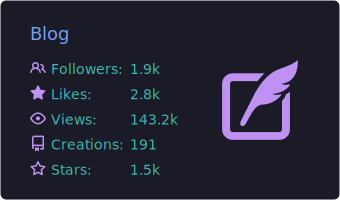

<h1 align="center">
  <code>Hi👋,我是&nbsp;ceilf6&nbsp;!</code>
</h1>

  

  <!--  -->
  如果想了解更多，点击上面👆对应卡片跳转

  05年生人，上海大学27届，联系 => 3506456886@qq.com

<h2 align="center">
  <code>我的一些探索</code>
</h2>

- **[FrontAgent](https://github.com/ceilf6/FrontAgent)** - 前端智能体
- **[Wiki](https://github.com/ceilf6/Wiki)** - 与 LLM 一起维护的知识库，供 [FrontAgent](https://github.com/ceilf6/FrontAgent) RAG增强检索生成
- **[ceilf6-skills](https://github.com/ceilf6/ceilf6-skills)** - 实用技能包
- **[DayMate](https://github.com/ceilf6/DayMate)** - 日历应用
- **[claude code source](https://ceilf6.github.io/cc-source/)** - claude code 源码学习网站
- **[operating-system](https://ceilf6.github.io/operating-system/)** - 操作系统课程学习网站
- **[Auto courseGrabber](https://github.com/ceilf6/Auto_courseGrabber)** - 实用脚本
- **[CPlusPlus](https://github.com/ceilf6/CPlusPlus)** - 算法课程 C++ 资料
- **[dataStructure](https://github.com/ceilf6/dataStructure)** - 数据结构课程资料
- **[SmartFruits](https://github.com/ceilf6/SmartFruits)** - 上海大学国家级项目，C++ 嵌入式配合 python 上位机编程的智能水果系统
- **[Mathematical Modeling](https://github.com/ceilf6/Mathematical-Modeling)** - 数学建模资料
- **[ScreenSniper](https://github.com/ceilf6/ScreenSniper)** - 截屏工具

<h3 align="center">
  <code>同时持续为社区贡献</code>
</h3>

- **[Tencent/cherry-markdown](https://github.com/Tencent/cherry-markdown)** - markdown editor
- **[goplus/builder](https://github.com/goplus/builder)** - 游戏开发平台
- **[utseus-competences.github.io](https://github.com/utseus-competences/utseus-competences.github.io)** - 学生职业规划网站
- **[pua](https://github.com/tanweai/pua)** - pua skill
- **[immersive-translate](https://github.com/immersive-translate/immersive-translate)** - 翻译插件
